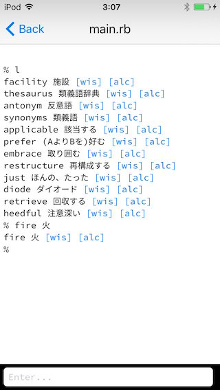

# Tango

Flashcard for RubyPico



## Usage

```
# Add word
% fire

# Add word and translation
% fire 火
```

```
# List
% l
fire 火 [dict]
sword 剣 [dict]

# List with keyword
% l sw
sword 剣 [dict]
```

```
# Remove word
% rm sword
```
